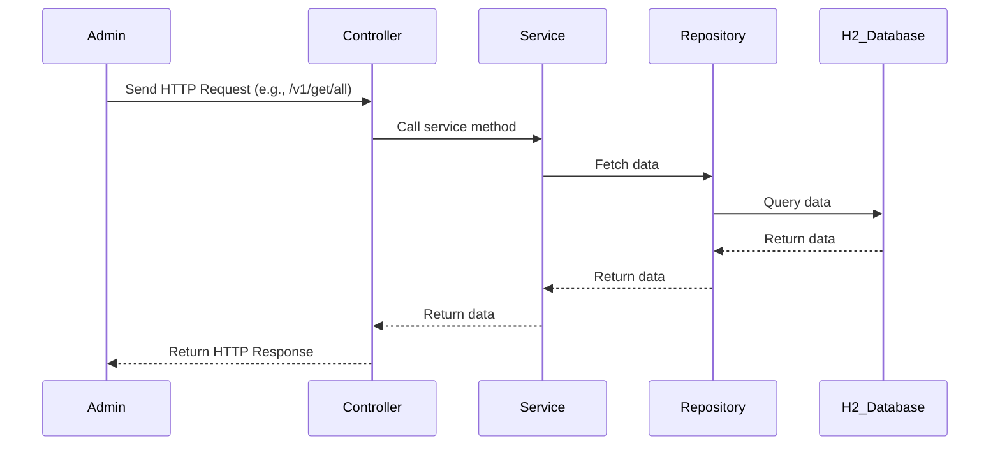

```mermaid
sequenceDiagram
participant Admin
participant Controller
participant Service
participant Repository
participant H2_Database

    Admin->>Controller: Send HTTP Request (e.g., /v1/get/all)
    Controller->>Service: Call service method
    Service->>Repository: Fetch data
    Repository->>H2_Database: Query data
    H2_Database-->>Repository: Return data
    Repository-->>Service: Return data
    Service-->>Controller: Return data
    Controller-->>Admin: Return HTTP Response
```